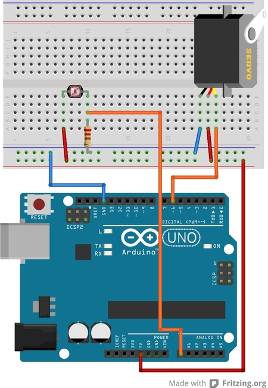
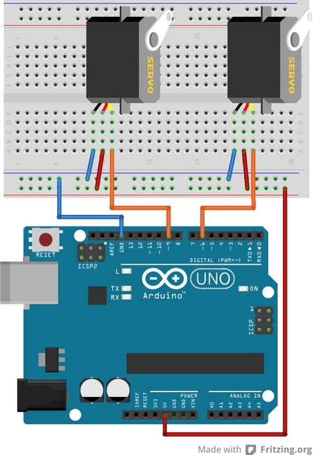

## Ohjelmointi opetuksessa

Materiaalia ohjelmoinnin opetukseen peruskouluissa ja lukioissa. Sisältö liittyy 5.10.2013 Jyväskylässä olleeseen luentoon ja työpajaan aiheesta **Innostava lähestymistapa ohjelmointiin**.

Käytettävien työkalujen keskeisenä osana on [Arduino](http://http://www.arduino.cc/), joka koostuu mikrokontrollerista ja ohjelmointiympäristöstä. Esimerkkien testaamisessa on ollut käytössä [Arduino Uno](http://arduino.cc/en/Main/ArduinoBoardUno)

Havainnollistamisessa on käytetty nallea, joka on hyvin perinteinen pehmolelu. Esimerkkejä voi toki hyödyntää muidenkin pehmolelujen kanssa. [Nallen rakennusohje](ohjeet/nallen_rakennus.md).

### Arduino-ympäristön asennus

Opinsys:n palvelun piiriin kuuluvilla laitteilla ympäristö on valmiiksi asennettuna.

Yhteisön sivuilta löytyy asennusohjeet eri käyttöjärjestelmille
* [Windows](http://arduino.cc/en/Guide/Windows)
* [Mac OS X](http://arduino.cc/en/Guide/MacOSX)
* [Linux](http://www.arduino.cc/playground/Learning/Linux)

## Vilkutus

Nalle vilkuttaa tassulla keskeytyksettä. Tassulle vuorotellaan kahta asentoa, joiden välissää on kahden sekunnin tauko.

**Komponentit**
* Servo: DFRobot SER0006

**Kytkentäkaavio**

*Video*

**Lähdekoodi:** [vilkutus.ino](vilkutus/vilkutus.ino)

## Ohikulkijalle vilkutus

Nalle vilkuttaa ohikulkijalle. Valovastuksen avulla tunnistetaan nallen edessä oleva liike ja tehdään tällöin tassulla vilkuttava liike.

**Komponentit**
* Servo: DFRobot SER0006
* Valovastus: VT90N2 LDR
* Vastus: 10k Ohm

**Kytkentäkaavio**

**Lähdekoodi:** [vilkutus.ino](ohikulkijalle_vilkutus/ohikulkijalle_vilkutus.ino)

## Tassujen heilutus

Nalle heiluttaa molempia tassujaan siten, että tassut ovat vastakkaisissa asennoissa. Molemmilla tassuilla on vain kaksi asentoa, joita vuorotellaan kahden sekunnin välein.

**Komponentit**
* 2 x Servo: DFRobot SER0006

**Kytkentäkaavio**

**Lähdekoodi:** [tassujen_heilutus.ino](tassujen_heilutus/tassujen_heilutus.ino)

## Tassujen heilutus tahdissa

Nalle heiluttaa molempia tassuja painonapin tahdissa. Molemmilla tassuilla on kaksi asentoa ja ne ovat aina vastakkaisissa asennoissa. Asentoa vaihdetaan aina kuin nappia painetaan.

**Komponentit**

* 2 x Servo: DFRobot SER0006
* Painonappi: Sparkfun COM00097
* Vastus: 10k Ohm

**Kytkentäkaavio**

**Lähdekoodi:** [tassujen_heilutus_tahdissa.ino](tassujen_heilutus_tahdissa/tassujen_heilutus_tahdissa.ino)

## Varoitus kaatumisesta

Nalle päästää hälytysäänen, jos se kaadetaan. Hälytysääni sammuu, kun nalle nostetaan takaisin istuma asentoon.

**Komponentit**
* Piezo kaiutin: Pololu POLO 30mm PIEZO 1260
* 2 x vastus: 10k Ohm
* Asentosensori: Active RBS 040100

**Kytkentäkaavio**

**Lähdekoodi:** [varoitus_kaatumisesta.ino](varoitus_kaatumisesta/varoitus_kaatumisesta.ino)

## Linkkejä

* [http://fritzing.org](http://fritzing.org) Avoimen lähdekoodin sovellus mm. kytkentäkaavioiden tekemiseen

## Lisessi

## Tekijänoikeus

Copyright © 2010 Opinsys Oy

Tämän projektin materiaali on Creative Commons 3.0 alaisuudessa

THE WORK (AS DEFINED BELOW) IS PROVIDED UNDER THE TERMS OF THIS CREATIVE
COMMONS PUBLIC LICENSE ("CCPL" OR "LICENSE"). THE WORK IS PROTECTED BY
COPYRIGHT AND/OR OTHER APPLICABLE LAW. ANY USE OF THE WORK OTHER THAN AS
AUTHORIZED UNDER THIS LICENSE OR COPYRIGHT LAW IS PROHIBITED.

BY EXERCISING ANY RIGHTS TO THE WORK PROVIDED HERE, YOU ACCEPT AND AGREE
TO BE BOUND BY THE TERMS OF THIS LICENSE. TO THE EXTENT THIS LICENSE MAY
BE CONSIDERED TO BE A CONTRACT, THE LICENSOR GRANTS YOU THE RIGHTS
CONTAINED HERE IN CONSIDERATION OF YOUR ACCEPTANCE OF SUCH TERMS AND
CONDITIONS.

