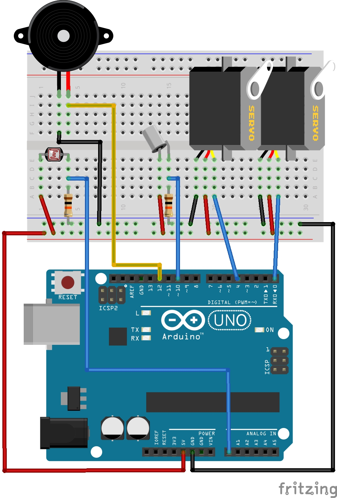

## Ohjelmointi opetuksessa

Materiaalia ohjelmoinnin opetukseen peruskouluissa ja lukioissa.

Käytettävien työkalujen keskeisenä osana on [Arduino](http://http://www.arduino.cc/), joka koostuu mikrokontrollerista ja ohjelmointiympäristöstä. Esimerkkien testaamisessa on ollut käytössä [Arduino Uno](http://arduino.cc/en/Main/ArduinoBoardUno)

Havainnollistamisessa on käytetty nallea, joka on hyvin perinteinen pehmolelu. Esimerkkejä voi toki hyödyntää muidenkin pehmolelujen kanssa. Opinsysiltä on saatavissa nalle valmiiksi paketoituna [rakennussarjana tai käyttövalmiina tuotteena](http://www.opinsys.fi/nalle).

[Nallen rakennusohje](ohjeet/nallen_rakennus.md).

[Ohje rakennussarjan kokoamiseen](ohjeet/ohje_rakennussarjalle.md)

## Arduino-ympäristön asennus

Opinsys:n palvelun piiriin kuuluvilla laitteilla ympäristö on valmiiksi asennettuna.

Yhteisön sivuilta löytyy asennusohjeet eri käyttöjärjestelmille
* [Windows](http://arduino.cc/en/Guide/Windows)
* [Mac OS X](http://arduino.cc/en/Guide/MacOSX)
* [Linux](http://www.arduino.cc/playground/Learning/Linux)

## Esimerkit

**Kytkentäkaavio**

**Komponentit**
* 2kpl Servoja: GWS Micro L STD Servo Motor (GWSMICROL/STD/F)
* Valovastus: LDR07
* Piezo-kaiutin: Ø17mm
* Asentokytkin: cw1300
* 2kpl Vastuksia 10kΩ

## Vilkutus

Nalle vilkuttaa tassulla keskeytyksettä. Tassulle vuorotellaan kahta asentoa, joiden välissää on kahden sekunnin tauko.

**Lähdekoodi:** [vilkutus.ino](vilkutus/vilkutus.ino)

## Tassujen heilutus

Nalle heiluttaa molempia tassujaan siten, että tassut ovat vastakkaisissa asennoissa. Molemmilla tassuilla on vain kaksi asentoa, joita vuorotellaan kahden sekunnin välein.

**Lähdekoodi:** [tassujen_heilutus.ino](tassujen_heilutus/tassujen_heilutus.ino)

## Ohikulkijalle vilkutus

Nalle vilkuttaa ohikulkijalle. Valovastuksen avulla tunnistetaan nallen edessä oleva liike ja tehdään tällöin tassulla vilkuttava liike.

**Lähdekoodi:** [vilkutus.ino](ohikulkijalle_vilkutus/ohikulkijalle_vilkutus.ino)

## Varoitus kaatumisesta

Nalle päästää hälytysäänen, jos se kaadetaan. Hälytysääni sammuu, kun nalle nostetaan takaisin istuma asentoon.

**Lähdekoodi:** [varoitus_kaatumisesta.ino](varoitus_kaatumisesta/varoitus_kaatumisesta.ino)

## Linkkejä

* [http://fritzing.org](http://fritzing.org) Avoimen lähdekoodin sovellus mm. kytkentäkaavioiden tekemiseen

## Tekijänoikeus

Tämän projektin materiaali on Creative Commons 3.0 alaisuudessa

