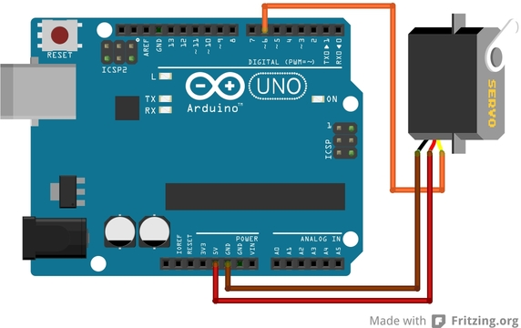

## Ohjelmointi opetuksessa

Materiaalia ohjelmoinnin opetukseen peruskouluissa ja lukioissa. Sisältö liittyy 5.10.2013 Jyväskylässä olleeseen luentoon ja työpajaan aiheesta **Innostava lähestymistapa ohjelmointiin**.

Käytettävien työkalujen keskeisenä osana on [Arduino](http://http://www.arduino.cc/), joka koostuu mikrokontrollerista ja ohjelmointiympäristöstä. Esimerkkien testaamisessa on ollut käytössä [Arduino Uno](http://arduino.cc/en/Main/ArduinoBoardUno)

### Arduino-ympäristön asennus

Opinsys:n palvelun piiriin kuuluvilla laitteilla ympäristö on valmiiksi asennettuna.

Yhteisön sivuilta löytyy asennusohjeet eri käyttöjärjestelmille
* [Windows](http://arduino.cc/en/Guide/Windows)
* [Mac OS X](http://arduino.cc/en/Guide/MacOSX)
* [Linux](http://www.arduino.cc/playground/Learning/Linux)

### Esimerkit

#### Vilkutus

[Lähdekoodi](vilkutus/vilkutus.ino)

*Video*

#### Tassujen heilutus

#### Tassujen heilutus tahdissa

*Painonapilla*

*Äänisensorilla*

#### Varoitus kaatumisesta

#### Vilkutus