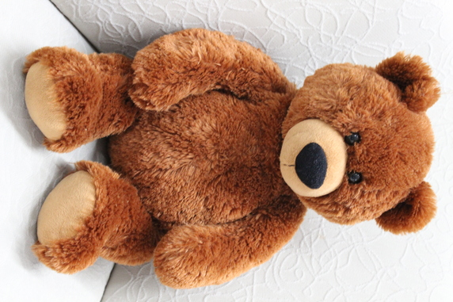
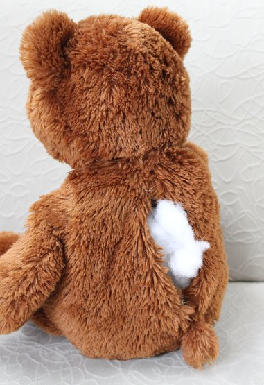
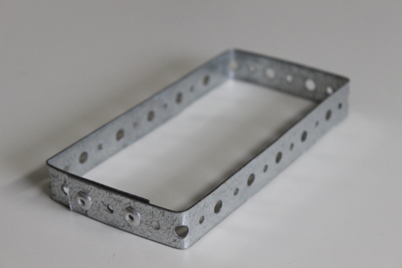
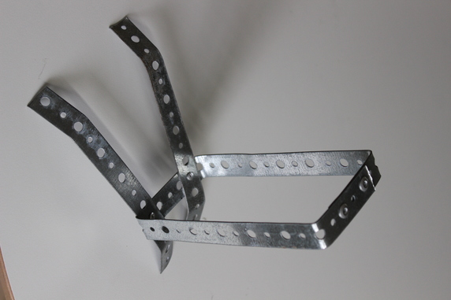
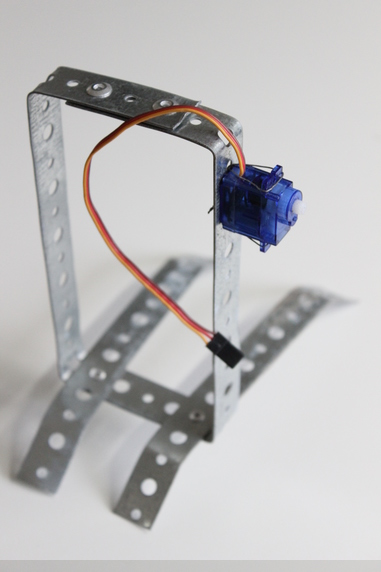
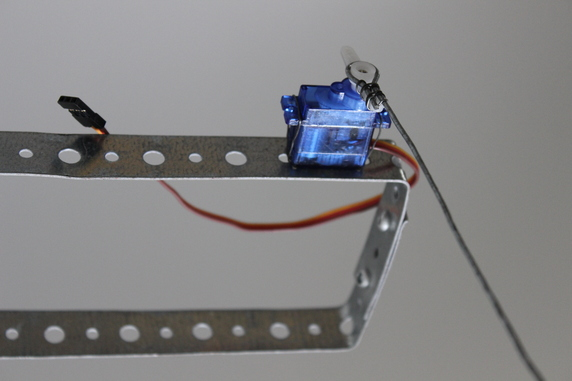
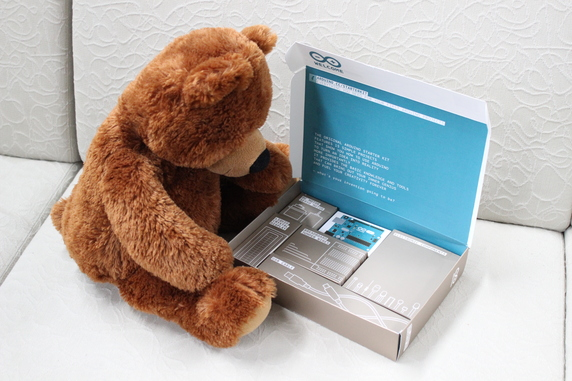

## Nallen rakennusohje

Löytyykö nurkistasi ylimääräisiä pehomoleluja? Tätä ohjetta voit soveltaa monenlaisiin pehmoleluihin. Riittttävän suuren koon lisäksi aino vaatimus on, että tassut ovat helposti liikuteltavissa. Esimerkin nalle löytyi kirpputorilta, joka tarjosikin hyvän valikoiman erillaisista pehmoleluista.

Esimerkissä käytetyt tarvikkeet:
* Nalle
* Reikävannetta
* Rautalankaa, vahvuus 1.5mm
* Rautalankaa, vavuus 0.5mm
* Vetoketju
* Neula ja lankaa
* Popniitit
* Kaksi servoa (DFRobot SER0006)

Tavoitteena on saada muokattua nallea siten, että istuvan nallen tassuja voidaan liikuttaa. Lisäksi tarvittavat ohjauskomponentit halutaan sijoitaa nallen sisään, jolloin se voi toimia paristolla ilman ulkoista kaapelia.

Ensimmäisenä toimenpiteenä on avata pehmolelu jostakin sopivasta kohtaa, jotta sisälle voidaan asentaa tassuja heiluttavat komponentit. Kyseisen nalle selässä oli sauma, joka olikin luonteva avauskohta.

Runkomateriaalina käytetään reikävannetta. Reikävanteesta taitellaan nallen kokoon sopiva nelikulmio. Reikävanteen päät kiinnitetään toisiinsa popniiteillä. Rungon kokoa sovittaessa ota huomioon servojen koko, jotta ne mahtuvat olemaan nallen sisässä ja liikuttamaan tassuja. Tarvittaessa täytettä voidaan poistaa nallen sisältä, jolloin rungon sovitus onnistuu helpommin.

Runkoon kiinnitetään reikävanteesta tehdyt jalat, joiden avulla nalle saadaan pysymään halutussa asennossa.

Servot kiinnitetään rungon yläpäähän rautalangalla.

Tassun sisälle tulee rautalanka, jonka pitää olla riittävän vahvaa kannatellakseen tassua. Rautalanka kiinnitetään servon varteen kiinni ohuella rautalangalla.

Lopuksi valmis runko varusteineen asetetaan nallen sisään. Aiemmin poistetua täytettä lisätään sen verran, että nalle pysyy ryhdikkäässä asennossa.

Selässä olevaan aukkoon voidaan ommellaan vetoketju, jolloin komponettien vaihto onnistuu helposti.

Valmis nalle yhteiselle tutkimusmatkalle ohjelmoinin ihmeelliseen maailmaan!

